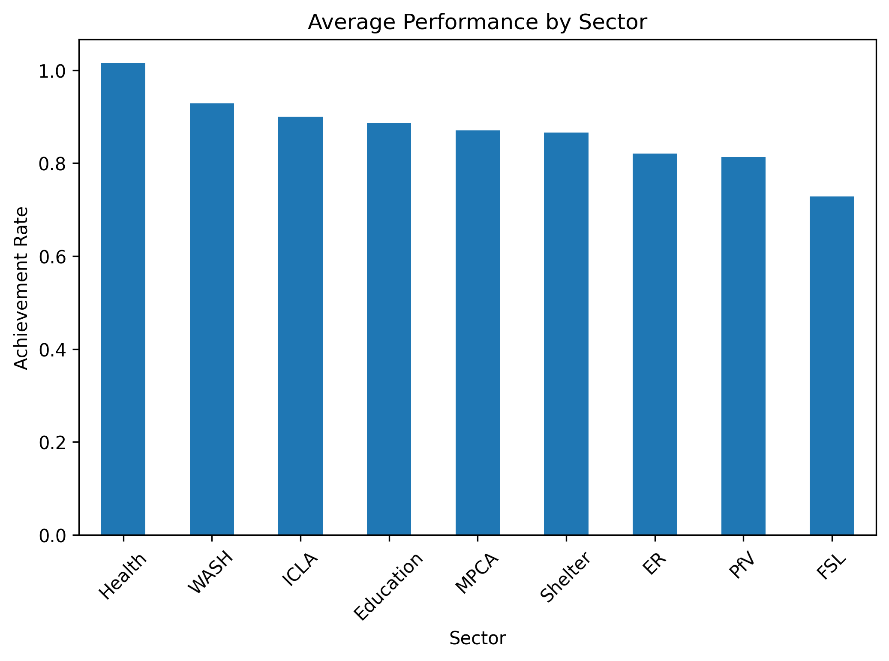

# humanitarian-performance-analysis
Data analysis project assessing humanitarian program performance across sectors and states using Python.

# Multi-Sector Humanitarian Program Performance Analysis

# 📖 Overview
This project analyzes the performance of a multi-sector humanitarian program across different states and sectors. The objective is to assess achievement against targets, identify underperforming areas, and support data-driven decision-making.

# 🧾 Data Description
The dataset simulates humanitarian program data including:
- Project information (sector, donor, state)
- Indicator tracking (target vs actual)
- Beneficiary data
- Activity tracking

Note: The dataset is synthetic and designed to reflect real-world MEAL structures.

# ⚙️ Methodology
- Data cleaning and processing using Python (Pandas)
- Creation of key performance indicators:
  - Achievement rate
  - Gap analysis
  - Performance classification
- Data merging across multiple tables
- Aggregation by sector and state

# 📊 Key Findings
## 🔹 Overall Performance
- 50% of indicators are On Track
- 30% require Attention
- 20% are Critical
## 🔹 Sector Insights
- Health sector shows the strongest performance
- FSL sector shows the weakest performance and requires immediate attention
## 🔹 Geographic Insights
- North Darfur is the best-performing state
- West Kordofan is the lowest-performing state

# 📊 Visualization

This chart shows average performance across sectors.

  

# 🛠️ Tools Used
- Python (Pandas)
- Google Colab
- Matplotlib

# 🛡️ Ethical Considerations
This project uses synthetic data designed to replicate humanitarian program structures while ensuring data protection and ethical compliance.
