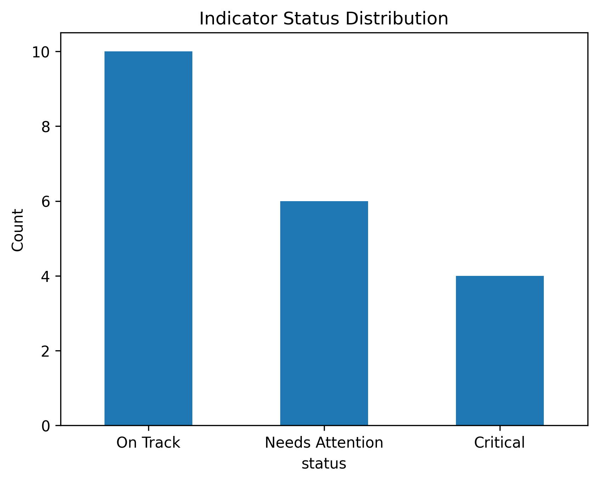
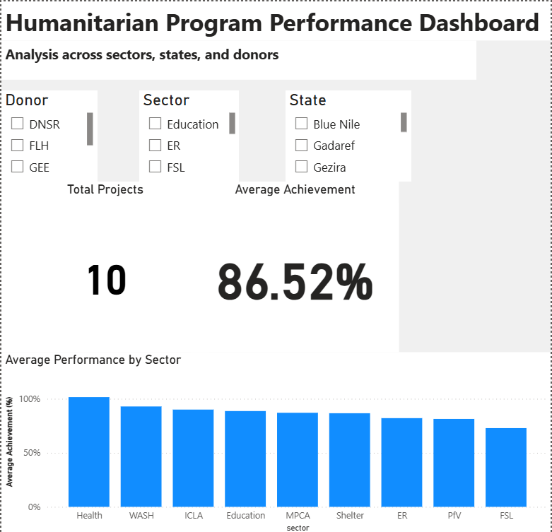

# humanitarian-data-analysis-python
Data analysis project assessing humanitarian program performance across sectors and states using Python.

# Multi-Sector Humanitarian Program Performance Analysis

## 📖 Project Overview
This project analyzes humanitarian program performance across multiple sectors and states.  
It focuses on tracking key indicators, identifying performance gaps, and highlighting areas requiring attention for better program decision-making.

## 📌 Key Insights
- 50% of indicators are On Track, indicating moderate overall program performance
- 30% require attention, suggesting targeted intervention is needed
- 20% are critical, highlighting areas of significant underperformance

## 📊 Visualization

This chart shows average performance across sectors.

  

## 📁 Project Structure
- `Projects_Data_set.xlsx` → Source data  
- `Projects_Data_set.ipynb` → Analysis notebook  
- `sector_performance.png` → Visualization  
- `README.md` → Project documentation  

## 🛠 Skills Demonstrated
- Data Cleaning & Preparation (Pandas)
- Data Analysis & Aggregation
- Data Visualization (Matplotlib)
- Performance Analysis (KPIs & Indicators)
- GitHub Project Documentation

  This project demonstrates key data analysis and reporting skills relevant to humanitarian program monitoring.

# 🛠️ Tools Used
- Python (Pandas)
- Google Colab
- Matplotlib

# 🛡️ Ethical Considerations
This project uses synthetic data designed to replicate humanitarian program structures while ensuring data protection and ethical compliance.

## 📢 Conclusion
The analysis highlights key performance gaps across sectors and geographic areas, supporting data-driven decision-making for improving humanitarian program effectiveness.
